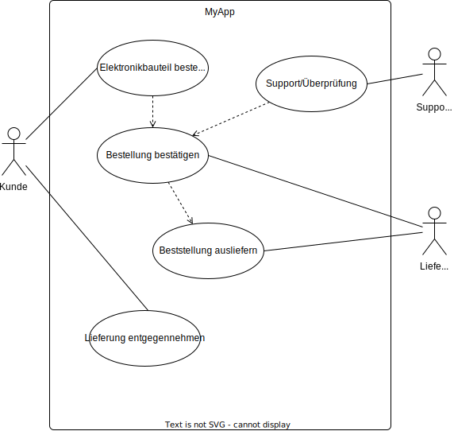

#  CREATE BOARD: MyApp

## IDEEN-BESCHREIBUNG
> Im Feld Ideenbeschreibung notieren wir den Kern unserer Idee. Sie sollte sich auf einen klaren Anwendungsfall fokussieren und diesen beschreiben.

## ADRESSIERTE NUTZER
> Im Feld Adressierte NutzerInnen schreiben wir Details und Besonderheiten zu den NutzerInnen auf, für die wir unsere Lösungsidee entwickeln.

## ADRESSIERTE BEDÜRFNISSE
> In Feld Bedürfnisse notieren wir die Bedürfnisse der NutzerInnen, die wir mit unserer Idee erfüllen wollen.

## PROBLEME
> Im Feld Probleme notieren wir die ein bis drei drängendsten Probleme, die mit diesen Bedürfnissen zu tun haben.

## IDEENPOTENZIAL
Mehrwert: Mückenstich vs. Hai-Attacke

🔵🔵🔵⚪️⚪️⚪️⚪️⚪️⚪️⚪️

Übertragbarkeit: Robinson Crusoe vs. die Welt

🔵🔵🔵🔵🔵⚪️⚪️⚪️⚪️⚪️

Machbarkeit: Hammer vs. Raumschiff

🔵🔵🔵🔵🔵🔵🔵🔵⚪️⚪️

## DAS WOW
> Im Feld Das Wow notieren wir das eine Detail unserer Lösungsidee, für das wir in der Presse gefeiert werden wollen.

## HIGH-LEVEL-KONZEPT
> Im Feld High-Level-Konzept notieren wir eine griffige Analogie, mit der wir unsere Lösungsidee beschreiben könnten.

## WERTVERSPRECHEN
> Ins Feld Wertversprechen schreiben wir unsere Lösungshypothese. Sie ist die Synthese aus Idee, NutzerIn, Bedürfnis und Ideenpotenzial. Und sie ist unsere Antwort auf die Wie-können-wir-Frage aus den EXPLORE-BOARD.
